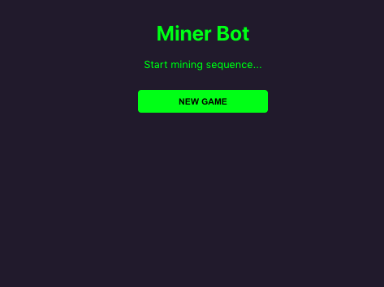
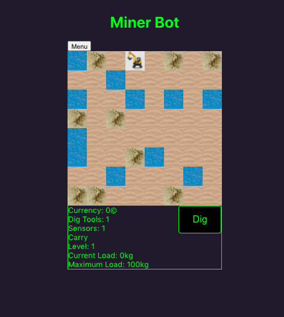
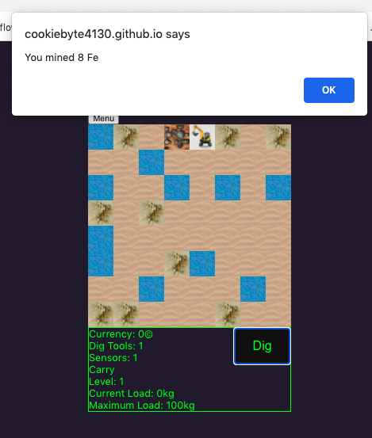
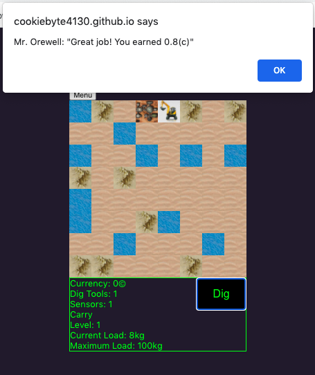

# MinerBot

[MinerBot image](https://cookiebyte4130.github.io/minerBotsv2/)

## Description

MinerBot is a game app built with React.

Users will be able to select New account, Load account, Save Progress, About (explains very basics of game and how © and rep can tie into HZRD acct) from the Main Menu.

The map is a procedurally generated 8x8 grid of dirt, cliff, and water tiles.

Users will be able to move the bot around the board and dig to collect resources.

Move Bot onto Base square, and buttons come up in bottom box area to drop off iron ore for © or buy level upgrades.

Buy upgrades to improve digging abilities.

## Deploying

npm install
git add / commit / push changes
npm run deploy

## System Requirements

173 MB storage

## Support

If you have any questions or comments regarding this app please email me at amaliacbryant@gmail.com

## Contributing

If you would like to contribute to MinerBot please do! I am open to all suggestions and help with this project. Content must be PG to keep it kid friendly.

## Authors and acknowledgment

Game concept: Raccoon
Code architect and writer: Amalia Bryant

## License

[MIT 2021 Amalia Bryant](https://choosealicense.com/licenses/mit/)

## Project status

An active work in progress
